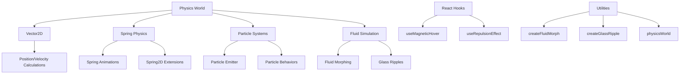

# Physics-Based Animation System

Liquidify's advanced physics-based animation system provides realistic motion, interaction, and visual effects through a comprehensive set of physics classes, constants, hooks, and utilities.

## Overview

The physics system enables:

- **Realistic Motion**: Spring-based animations with proper physics
- **Particle Effects**: Complex particle systems with emitters and behaviors
- **Fluid Dynamics**: Smooth liquid-like morphing and flow animations
- **Magnetic Interactions**: Hover and repulsion effects
- **Glass Surface Effects**: Ripples and distortions on glass surfaces

## Core Architecture



## Quick Start

```typescript
import {
  Vector2D,
  SpringPhysics,
  ParticleEmitter,
  useMagneticHover,
  createFluidMorph
} from 'liquidify';

// Basic spring animation
const spring = new SpringPhysics({
  stiffness: 100,
  damping: 10,
  mass: 1
});

// Magnetic hover effect
const MagneticButton = () => {
  const magneticRef = useMagneticHover({
    strength: 0.3,
    distance: 100
  });

  return (
    <button ref={magneticRef} className="glass-button">
      Hover me!
    </button>
  );
};
```

## System Components

### Core Classes

- **[Vector2D](/physics-system/core-classes/vector2d)** - 2D vector mathematics
- **[SpringPhysics](/physics-system/core-classes/spring-physics)** - Spring force calculations
- **[Spring2D](/physics-system/core-classes/spring2d)** - 2D spring systems
- **[ParticleEmitter](/physics-system/core-classes/particle-emitter)** - Particle generation and management
- **[FluidSimulation](/physics-system/core-classes/fluid-simulation)** - Fluid dynamics simulation

### Physics Constants

- **[PHYSICS_CONSTANTS](/physics-system/constants/physics-constants)** - Fundamental physics values
- **[SPRING_PRESETS](/physics-system/constants/spring-presets)** - Pre-configured spring settings

### React Hooks

- **[useMagneticHover](/physics-system/hooks/use-magnetic-hover)** - Magnetic attraction effects
- **[useRepulsionEffect](/physics-system/hooks/use-repulsion-effect)** - Element repulsion interactions

### Utilities

- **[createFluidMorph](/physics-system/utilities/create-fluid-morph)** - Fluid morphing animations
- **[createGlassRipple](/physics-system/utilities/create-glass-ripple)** - Glass surface ripples
- **[physicsWorld](/physics-system/utilities/physics-world)** - Physics simulation manager

## Interactive Demos

### Particle Effects

Experience real-time particle systems with various behaviors and emitters.

[View Particle Demo →](/physics-system/demos/particle-effects)

### Spring Animations

Explore different spring configurations and their visual effects.

[View Spring Demo →](/physics-system/demos/spring-animations)

### Fluid Dynamics

See fluid morphing and surface interaction effects in action.

[View Fluid Demo →](/physics-system/demos/fluid-dynamics)

## Performance Considerations

The physics system is optimized for performance:

- **GPU Acceleration**: Hardware-accelerated transformations
- **Efficient Calculations**: Optimized mathematical operations
- **Batched Updates**: Grouped DOM modifications
- **Responsive Design**: Adapts to device capabilities

## Best Practices

1. **Use Appropriate Presets**: Start with `SPRING_PRESETS` for common effects
2. **Optimize Particle Count**: Balance visual quality with performance
3. **Batch Operations**: Use `physicsWorld.batch()` for multiple updates
4. **Memory Management**: Properly dispose of physics objects
5. **Device Adaptation**: Use performance hooks for device-specific optimizations

## Examples

### Basic Spring Animation

```typescript
const spring = new SpringPhysics(SPRING_PRESETS.gentle);
spring.setTarget(new Vector2D(100, 200));
spring.update(deltaTime);
```

### Particle System

```typescript
const emitter = new ParticleEmitter({
  position: new Vector2D(0, 0),
  rate: 60,
  lifetime: 2000,
  velocity: new Vector2D(0, -100),
});
```

### Fluid Morph

```typescript
const morph = createFluidMorph({
  element: '.liquid-element',
  from: { borderRadius: '0%' },
  to: { borderRadius: '50%' },
  duration: 1000,
});
```

## Next Steps

- Explore the [Core Classes](/physics-system/core-classes) for detailed API references
- Check out [Interactive Demos](/physics-system/demos) to see the system in action
- Learn about [Performance Optimization](/physics-system/performance) techniques
- Browse [Real-World Examples](/physics-system/examples) for inspiration
